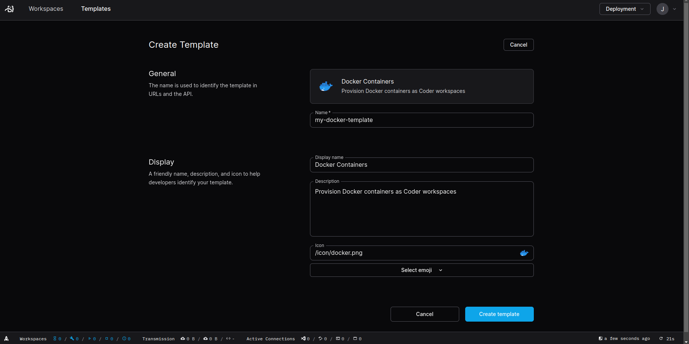

# Quickstart

This guide will walk you through your first steps with Coder. It will go over
how to:

- create [templates](./templates/index.md) to define your developer environments
  and resources.
- provision [workspaces](./workspaces/index.md) from a template so that you can
  connect and begin development.

## Prerequisites

Before you begin, ensure that you have satisfied the following prerequisites:

- [Install Coder](./install.md): Install Coder on your local computer to run the
  Coder server and CLI.
- [Install Docker](https://docs.docker.com/engine/install/): Install Docker on
  your local computer to build and run your development environments.

## Start the Coder server

To begin, start the Coder server if it is not already running by typing the
following in your terminal:

```bash
coder server
```

The Coder server will launch, executing a local PostgreSQL database and
listening on a local port.

## Create an administrator account

Navigate to web interface in your web browser. This will be
`http://127.0.0.1:3000` by default.

If this is your first time running the Coder server, you will be prompted to
create your first administrator account:


Fill in an account name, your full name, an email address, and a password. Click
**Create account** to continue.

Your account will be created and you will be automatically logged in and
redirected to the workspaces page:


## Create your first template

[Templates](./templates/index.md) are the components in Coder that define
development environments. They control the image, resources, and platform that
the development environment will use with Terraform. Before you can create a
development environment, you must create a template.

Click **Templates** in the top navigation header. Find the **Docker Containers**
template in the template list and click **Use template**.


On the page that follows, choose a name for the template and optionally modify
the display name, description, and icon. This guide will use
`my-docker-template` as the template name:



Click **Create template** to continue.

Coder will initialize the template, redirecting you the template's **Source
Code** tab when complete. Here, you can see the template's initial `Dockerfile`,
Terraform `main.tf` file, and an initial `README.md` describing the template:


You will learn how to [customize these files](#customize-your-template) later in
this guide. For now, continue on to learn how to create a workspace from the
template.

## Create a workspace

To create a workspace from your template, click the **Create Workspace** button
from your template page.

In the form that follows, choose a name for your workspace. This guide will use
`my-workspace` as the workspace name:


Click **Create Workspace** to continue.

Coder will provision a workspace for your user based on the template you created
using Terraform:


Once the workspace is initialized, you can connect to it using SSH to take a
look around.

## Connect to your workspace

Now that you have a workspace available, you can connect to it using SSH or your
IDE. This guide will demonstrate how to connect using SSH.

### Log in to your Coder server using the CLI

Before you can connect to your workspace with SSH, you need to authenticate to
your Coder server instance from the command line.

To log in using the command line, enter the following in your terminal:

```bash
coder login http://127.0.0.1:3000
```

A new tab will open in your web browser displaying a session token:


Copy the code from the browser tab and paste it into the terminal where prompted
and press <kbd>ENTER</kbd>. A message will be displayed confirming that you are
now authenticated through the CLI.

### List the available workspaces

Now that you are logged in, list your available workspaces by typing:

```bash
coder list
```

The command will return a list of workspaces that your user has access to:

```
WORKSPACE                   TEMPLATE            STATUS   HEALTHY  LAST BUILT  CURRENT VERSION  OUTDATED  STARTS AT  STOPS AFTER
  jellingwood/my-workspace  my-docker-template  Started  true     12m         blissful_pike7   false                1d
```

In this case, the above output shows a single workspace, scoped with the
username, in the first column.

### SSH into your workspace

You can connect to your workspace with SSH using the CLI.

Use the following command, substituting your own workspace name for
`my-workspace` below:

```bash
coder ssh my-workspace
```

You will be automatically logged into your the configured workspace without
further authentication.

When you are finished exploring, exit out of the development environment by
typing:

```bash
exit
```

## Customize your template

Your template and workspace are currently configured using the default files
defined by Coder's Docker template. While this is a good starting point, you can
customize it to your liking.

### Pull your current template

First, list your available templates by typing:

```bash
coder templates list
```

The list of templates accessible from your account will be displayed:

```
NAME                LAST UPDATED     ORGANIZATION NAME   USED BY
my-docker-template  August 19, 2024  first-organization  0 active developers
```

In this example, only the `my-docker-template` created earlier is available.

Use the following command to download the files associated with your template.
Substitute your own template name for `my-docker-template` in the command:

```bash
coder templates pull my-docker-template
```

The template files will be placed in a directory named after the template.

### Modify the template files

Navigate into the template directory by typing:

```bash
cd my-docker-template
```

Inside, you will find the same files and directory structure outlined in the
template **Source Code** tab earlier:

```
.
├── build
│   └── Dockerfile
├── main.tf
└── README.md
```

Open the `build/Dockerfile` in your editor. Inside, make the following change:

- Add the `htop` package to the list of packages installed by the
  `apt-get install` command. Remember to add the trailing backslash to the end
  of the line.
- Add a `RUN` instruction to create a file called `/hello-world` with the
  `touch` command.

The `build/Dockerfile` should look like this when complete:

```dockerfile
FROM ubuntu

RUN apt-get update \
	&& apt-get install -y \
	curl \
	git \
	golang \
	htop \
	sudo \
	vim \
	wget \
	&& rm -rf /var/lib/apt/lists/*

RUN touch /hello-world

ARG USER=coder
RUN useradd --groups sudo --no-create-home --shell /bin/bash ${USER} \
	&& echo "${USER} ALL=(ALL) NOPASSWD:ALL" >/etc/sudoers.d/${USER} \
	&& chmod 0440 /etc/sudoers.d/${USER}
USER ${USER}
WORKDIR /home/${USER}
```

Save and close the file to continue.

### Upload the modified template

Now you can upload your changes to create a new version of the
`my-docker-template`.

Inside of your template directory, run the following command:

```bash
coder templates push
```

You will be warned about the lack of a `.terraform.lock.hcl` file and prompted
to confirm uploading the current directory. Type `yes` to confirm the operation
and upload your new version.

Your new template will be uploaded to the Coder server. It will be immediately
available to all users who have access the template.

## Update your workspace

With the template updated, you can now update your associated workspace.

List your workspaces again by typing:

```bash
coder list
```

This time, the `OUTDATED` column will have a value of `true`, indicating that an
update is available to your workspace.

Update your workspace with the new template version by typing:

```bash
coder update my-workspace
```

Coder will begin building a new environment based on the latest version of your
template. In this case, this involves rebuilding the Docker image and
provisioning a container from the new image.

Once the workspace is updated, SSH into the workspace to verify your changes:

```bash
coder ssh my-workspace
```

**Note:** You might receive a message indicating that some of the startup
scripts are still running if you SSH very soon after updating. You can find out
more on the
[troubleshooting page](https://coder.com/docs/templates/troubleshooting#your-workspace-may-be-incomplete).

Inside your development environment, verify that the new package is available by
typing:

```bash
htop
```

You can exit the system monitor application by pressing <kbd>q</kbd> when you
are done.

Check the root directory to see if the new file was created:

```bash
ls /
```

The listing should now include an empty `hello-world` file, as expected:

```
bin  boot  dev  etc  hello-world  home  lib  lib64  media  mnt  opt  proc  root  run  sbin  srv  sys  tmp  usr  var
```

## Where to go from here?

This guide covered some of the basics of how to get started with templates and
workspaces with Coder.

To learn more about how to create and manage development environments, check out
the following pages:

- [Templates](./templates/index.md): Find out more about how to create and
  manage templates to create your ideal development environments
- [Workspace](./workspaces.md): Launch and manage workspaces to make the
  transition to remote development
- [IDEs](./ides.md): Connect to your workspaces with your favorite IDE
- [Dotfiles](./dotfiles.md): Customize your workspaces by bringing along your
  personal dotfiles
